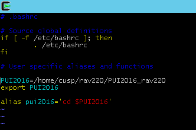

Lab 
Created gittest_rav220 directory and myfirstfile.txt locally.
Created gittest_rav220 repsitory locally & synched to remote.
Added/committed/pushed myfirstfile.txt to remote.
Modified myfirstfile.txt and resolved merging conflict between remote and local.

Created PUI2016_rav220 repository and HW1_rav220 folder with this README (synched locally and remotely)
(Achilles Saxby, Aaron D'Souza, Akshay Pen, Vishwajeet Shelar - a big help clearing up system files and resolving linking nauances)

Forked/cloning/Pull with Akshay Pen (found on gittest_akp418)

Created environment variable PUI2016 pointing to PUI2016_rav220 directory (found in .bashrc)
Created alias pui2016 to change directory to PUI2016_rav220 using PUI2016 as environment variable (found in .bashrc)

