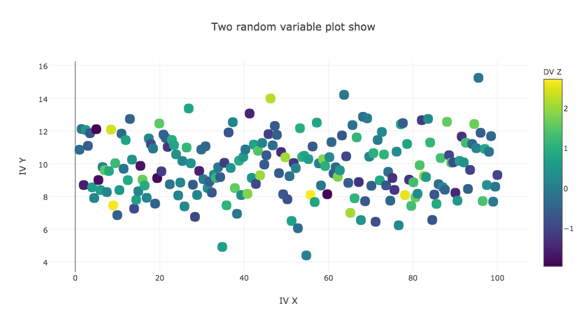

# HW7 Plot Review (yw2278)
By: Tashay Green 

## The Plot

**CLARITY**: The plot is a bit ambiguous considering the variables are random. The axes, if labeled more specifically, can be really useful in understanding what the plot is showing.

**AESTHETIC**: The gradiation of the circles represent a quantity but I am unable to identify the pattern. 

**SUGGESTIONS**: 
- Specifically label each axis 
- Add caption to describe data displayed in plot
- Choose meaningful data to plot, if possible